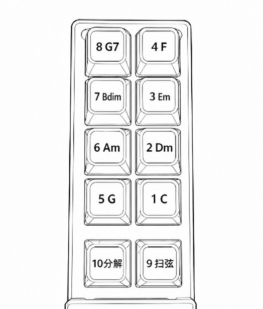

# D15 吉他下载与快速使用

> 第一次使用只需四步：**安装 App → 连接吉他 → 导入歌曲 → 开始跟弹**

## 1. 安装 App

### iPhone / iPad

**[前往 App Store 安装“D15吉他”](https://apps.apple.com/cn/app/d15%E5%90%89%E4%BB%96/id6799462676)**

打开链接后，点击“获取”即可安装。

### Android 手机 / 平板

**[下载最新版 D15吉他 Android APK（1.1.0）](https://gitee.com/d15cyber/d15-downloads/releases/download/android-v1.1.0/D15Guitar-Android-v1.1.0.apk)**

下载后点击 APK 安装；如果系统拦截，请按提示允许本次安装。请只使用本页面提供的安装包。

---

## 2. 连接吉他

**首选 USB：请务必连接吉他左侧 USB 端口。** 使用支持数据传输的 USB 线连接吉他和手机。打开 App，显示“有线/外设 MIDI 已连接”后即可使用。

**其次蓝牙：** 给吉他接通 5V 电源，打开 App，点击右上角蓝牙按钮，扫描并选择 `D15Guitar`。Android 设备请优先使用 USB。

**[查看蓝牙与 USB 连接说明（PDF）](https://gitee.com/d15cyber/guitar-docs/raw/main/connection-guide.pdf)**

## 3. 导入歌曲

**推荐从 URL 导入：** 在售后群获取曲谱地址并复制，然后进入“智能谱 → 导入歌曲 → 从 URL 导入 → 粘贴 → 下载并导入”。

**备用 ZIP 导入：** 先将 ZIP 曲谱包保存到手机本地，再进入“导入歌曲 → 导入文件”，选择 ZIP 文件。

<!-- 曲谱下载地址不在公开首页展示，由售后群提供。 -->

## 4. 开始跟弹

新手建议直接进入“智能谱”。选择歌曲后，看到谱面上的和弦字母，就按吉他上对应的和弦键，再使用扫弦或分解键演奏。

需要辅助时，可以打开主旋律、鼓机和节拍器伴奏。

### 无字母按键的键位对照

部分吉他的按键没有印字母，请按下面的默认 C 调键位图识别：

**1=C · 2=Dm · 3=Em · 4=F · 5=G · 6=Am · 7=Bdim · 8=G7 · 9=扫弦 · 10=分解**

> 图中为默认 C 调基础和弦组。切换 G 组或自定义和弦组后，按键对应和弦会变化。

## 使用资料

- **[D15 吉他完整使用说明（PDF）](https://gitee.com/d15cyber/guitar-docs/raw/main/usage-guide.pdf)**
- **[蓝牙与 USB 连接说明（PDF）](https://gitee.com/d15cyber/guitar-docs/raw/main/connection-guide.pdf)**
- **[DIY 模型、固件与备用共享文件（百度网盘）](https://pan.baidu.com/s/1bjUIKXNQAlNU6eSiYbjJ8w?pwd=m9vf)**

> 固件必须与吉他硬件版本匹配，升级前请先联系售后确认。

## 视频教程

更多安装、连接和功能教程，请关注群主视频号。

<!-- 待提供视频号链接或二维码后，在这里补充。 -->

## 售后支持

微信：`D15Cyber`

如遇问题，请同时说明吉他硬件版本、手机型号，以及当前使用 USB 还是蓝牙连接。
